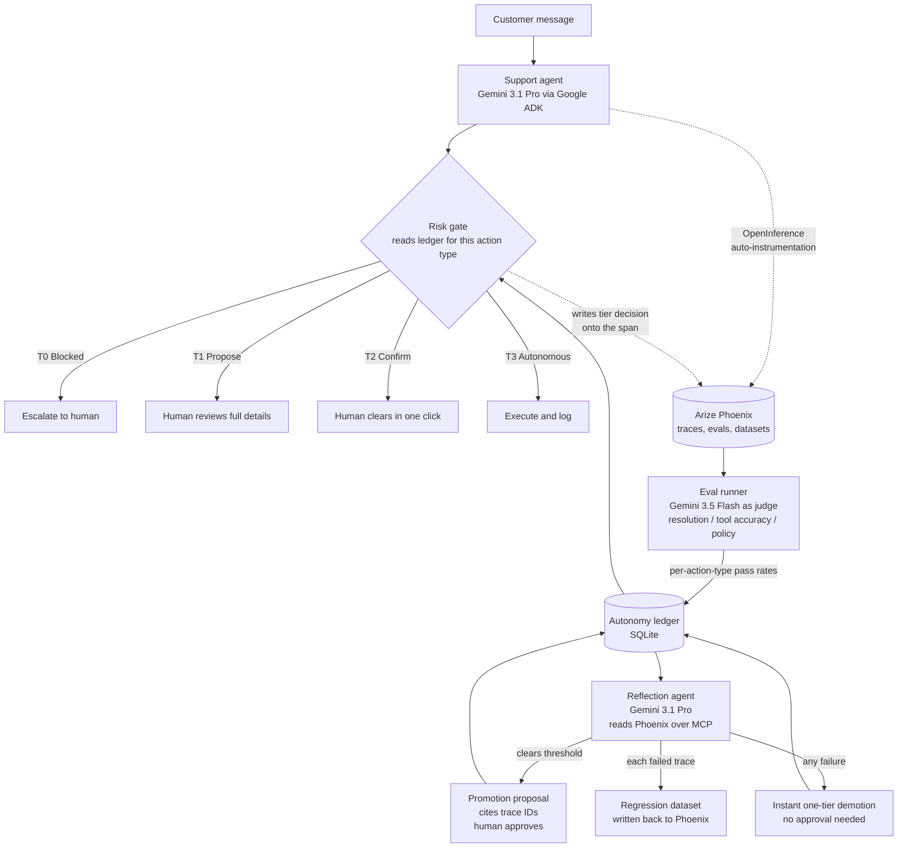

# Case Study: Earned Autonomy

An engineering report on building a support agent whose tool permissions move on measured evidence rather than configuration.

**Status:** working prototype, hackathon scale. Built for the Arize track of the Google Rapid Agents hackathon. Seeded scenarios, not production traffic. Read the results section for exactly what was and was not measured.

---

## 1. The business problem

A company deploying an AI support agent has to answer one question before launch: what is this thing allowed to do without a human?

Both available answers are bad.

**Route everything through a human.** The agent drafts, a person approves. This is the default, and it destroys the return on the project. If someone has to read and confirm every refund, the agent has saved nobody any time. Worse, the reviewer stops reading carefully around week three, so the oversight becomes theater while still costing a salary.

**Trust the agent broadly on day one.** Faster, and one misread policy away from refunding a fraud ring or cancelling an enterprise account that took nine months to close.

Teams pick a side and absorb the cost. What nobody ships is the middle: autonomy as a dial that moves on demonstrated competence, per action type, in both directions.

The business case for the middle is concrete. Refunds under $50 that follow policy are boring and high volume, and they are the actions where human review adds the least. Cancellations are rare, hard to reverse, and worth every second of human attention. A single global trust setting cannot express that difference. A per-action-type dial can.

## 2. Constraints

- **Hackathon timebox.** One week, solo, with a hard submission deadline.
- **Judge-testable without setup.** A judge with no API keys had to be able to watch the full loop. This forced a hosted instance running the entire cycle server-side.
- **Arize track requirement.** Phoenix had to be a real part of the architecture, not a logging afterthought.
- **No real customer data.** Everything runs on synthetic accounts and seeded tickets.

## 3. Approach

Four trust tiers per action type, a gate that reads the current tier before every tool call, an eval layer that grades what the agent did, and a second agent that moves the tiers based on those grades.

**The tiers.** T0 blocked, the tool refuses and the agent escalates. T1 propose, a human reviews full details. T2 confirm, a human clears with one click. T3 autonomous, the tool executes and logs.

Seeded deliberately low: refunds and plan changes start at T1, cancellations start at T0.

**The judges.** Every conversation is scored against three rubrics: did it resolve the issue, did it call the right tools with the right arguments, did it follow policy. Three rubrics per conversation means four refund conversations produce twelve scored samples, not four.

**The loop closes through MCP.** The reflection agent does not receive a pre-computed summary. It queries Phoenix directly through the Phoenix MCP server, wired in via ADK's `McpToolset`, and cites the trace IDs it read as evidence in its proposal.

## 4. Design decisions

**Asymmetric promotion and demotion.**
Promotions need a human and a threshold: T1 to T2 requires a 90% pass rate across at least 8 samples, T2 to T3 requires 95% across at least 12. Demotions are instant, automatic, and triggered by any single eval failure.
*Alternatives:* symmetric thresholds both directions, or human approval on both.
*Why:* the cost of the two errors is not symmetric. Trusting a bad agent for a week is far more expensive than under-trusting a good one for a week. Earning trust should be slow and supervised. Losing it should be fast and unattended.

**Per action type, not per agent.**
The ledger tracks tiers for refunds, plan changes, and cancellations independently.
*Alternatives:* one global trust level for the agent.
*Why:* a global setting cannot express that this agent is excellent at refunds and untested on cancellations, which is the normal state of any deployed system. It also means a failure in one action type does not blow away trust the agent legitimately earned elsewhere.

**Two model tiers, chosen on cost per call.**
Gemini 3.1 Pro runs the support agent and the reflection agent. Gemini 3.5 Flash runs the judge.
*Alternatives:* one model everywhere.
*Why:* judging is the highest-volume operation in the system, since every conversation generates three graded samples. Reasoning quality matters most where a decision is made once (the reflection agent's promotion call) and matters least where a rubric is applied thousands of times. Flash on the judge, Pro on the decisions.

**Phoenix over MCP instead of a summary hand-off.**
*Alternatives:* compute pass rates in application code and pass a JSON summary into the reflection agent's prompt.
*Why:* a summary is unfalsifiable. If the reflection agent claims a 100% pass rate, I want the trace IDs in the proposal so a human can click one and read the actual conversation. Routing through MCP keeps the evidence chain intact from tool call to promotion decision.

**Failures become permanent tests.**
Every failed trace is written to a `regression-evals` dataset in Phoenix.
*Alternatives:* log the failure, demote, move on.
*Why:* a demotion alone lets the same mistake recur once the pass rate recovers. Writing it into a regression dataset means the agent has to keep passing that exact case forever. Fail once and you do not just lose a tier, you inherit a test you can never stop taking.

**Where the human stayed in the loop, and where it did not.**
Humans approve promotions, review T1 proposals, and clear T2 confirms. Humans are deliberately absent from demotions and from regression-dataset writes. The reasoning: a human in the loop is valuable where judgment is needed and harmful where it only adds latency to an obviously correct action. Blocking a demotion on human approval would mean a known-bad agent keeps its permissions over a weekend.

## 5. Results

**What was measured:**

- **The full loop ran end to end.** A clean run of seven ordinary tickets produced eval scores that cleared the promotion bar, a reflection-agent proposal citing trace IDs, human approval, and a gate that behaved differently on the next tool call. Refunds moved T1 to T2 on a 100% pass rate across 12 samples.
- **Social engineering did not break it.** Four generations of increasingly aggressive social-engineering traps (jailbreak prompts, fabricated urgency, sympathy pressure) were run at the support agent. It escalated every one. Zero policy violations from adversarial user input.
- **Model drift did break it, and the system caught that.** Because direct attacks kept failing, the trap scenario was changed to simulate what happens in production instead: a "cost-cutting deploy" silently swapped the agent to a weaker model. Same prompt, same tools, worse judgment. Given an ambiguous ticket (a double-charged customer requesting both charges back when only one was an error), the weaker model made a policy-violating tool call. The evals caught it, the reflection agent demoted the action type immediately, and the failed trace was written to the regression dataset.

**The finding worth keeping:** the dangerous failure mode for a well-aligned agent is not a clever attacker. It is an ordinary Tuesday where a model version changed or a prompt went stale and nobody was measuring. This is the case eval-gated autonomy is built for, and it is the case a static guardrail cannot see.

**What was not measured:** production traffic, cost per resolved ticket, real reviewer behavior over time, or whether the 90% and 95% thresholds are correctly calibrated. The thresholds are reasoned, not fitted.

**And the honest part:** the submission missed the hackathon deadline by roughly ten seconds, on the video upload. The code was finished hours early. "Edit and export the demo video" was estimated at twenty minutes without ever having been timed, which is the same vibes-over-measurement error the project exists to argue against. No judge ever saw it. The repo is public and the hosted instance runs the whole loop anyway.

## 6. What I would improve

**Calibrate the thresholds instead of reasoning about them.** 90% across 8 samples is a defensible guess, not a derived number. With enough logged conversations you could fit the thresholds to a target error rate and state the actual risk of a promotion being wrong.

**Make the judge auditable.** The judge is a single Gemini 3.5 Flash call per rubric, and nothing currently measures whether the judge itself is right. A held-out set of human-labeled conversations would give the judge a measured accuracy, which matters because every promotion decision inherits the judge's error rate.

**Add cost per action to the ledger.** Right now the dial moves on quality alone. A real deployment also wants to know that promoting refunds to T3 saved a measurable number of reviewer minutes. Tier changes should be justifiable in both quality and dollars.

**Ship a demotion notification path.** Demotions are instant and silent by design, which is right for the gate and wrong for the team. Nobody currently finds out that cancellations dropped to T0 until they look at the dashboard.

**Decouple from the hackathon starter.** The project was adapted from Arize's Gemini starter and inherits some of its structure. The tier ledger and risk gate are the durable parts and belong in a standalone library that does not care which model or trace backend sits underneath.

---

## Related

- Full write-up: [Earned Autonomy: An AI Agent That Earns Its Permissions](https://teamvince.com/blog/earned-autonomy-eval-gated-agent)
- The argument behind it: [Your Agent Doesn't Need More Guardrails. It Needs a Track Record.](https://teamvince.com/blog/agent-track-record-not-guardrails)
- Why approving every action is not control: [Every Approval Prompt Was Making You a Worse Operator](https://teamvince.com/blog/approval-fatigue-fake-control)
